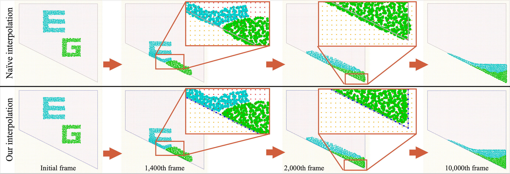

# Accurate Boundary Condition for Moving Least Squares Material Point Method using Augmented Grid Points

## Abstract
This paper introduces an accurate boundary-handling method for 
the moving least squares (MLS) material point method (MPM), 
which is a popular scheme for robustly simulating deformable objects and 
fluids using a hybrid of particle and grid representations coupled 
via MLS interpolation. Despite its versatility with different materials, 
traditional MPM suffers from undesirable artifacts around wall boundaries,
for example, particles pass through the walls and accumulate. 
To address these issues, we present a technique inspired by a line handler
for MLS-based image manipulation. Specifically, we augment the grid 
by adding points along the wall boundary to numerically compute 
the integration of the MLS weight. These additional points act 
as background grid points, improving the accuracy of the MLS 
interpolation around the boundary, albeit with a marginal increase 
in computational cost. In particular, our technique makes 
the velocity perpendicular to the wall nearly zero, 
preventing particles from passing through the wall.
We compare the boundary behavior of 2D simulation against that of 
naive approach.

|naive|ours|
|---|---|
|||